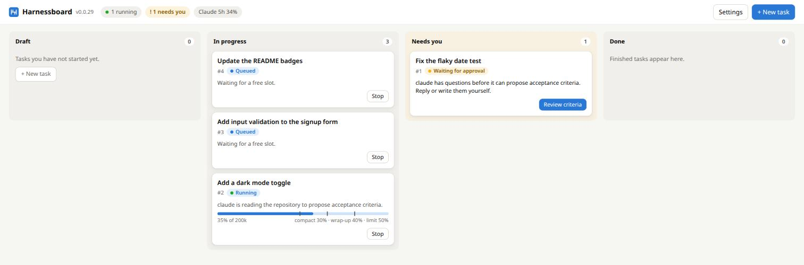
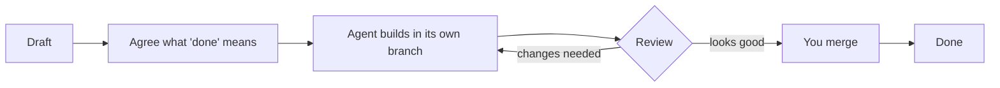
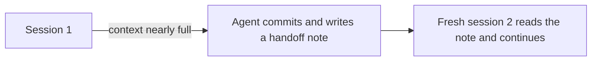

# Harnessboard


**English** · [繁體中文](README.zh-TW.md)

**Harnessboard lets you hand coding jobs to Claude Code and review the results like pull
requests.** You write a task in plain words. An AI agent does it in its own copy of your
project, and you read the diff and decide whether to merge. Several tasks can run side by
side, and none of them touches your files until you say so.



> [!NOTE]
> **Early development (0.0.x).** The runner, the `hb` command, the web board and Loop mode
> work. Windows and macOS have not been tested on real machines yet.

**On this page:** [Words you will see](#words-you-will-see) ·
[Before you start](#before-you-start) · [Install](#install) · [Your first task](#your-first-task) ·
[How a task flows](#how-a-task-flows) · [Everyday commands](#everyday-commands) ·
[Go further](#go-further)

## Why use it

- **Safe by default:** every task works in its own git branch and folder, so a bad result
  costs you nothing.
- **Small contexts:** an AI's memory (its _context_) fills up and its answers get worse.
  Harnessboard asks the agent to save its progress in a note and continues in a fresh
  session.
- **Quota-aware:** it watches your Claude subscription's usage, stops starting work near the
  limit and continues after the reset.
- **No API key:** it drives the `claude` program you already signed in to.
- **Your choice of model and effort:** pick each role's model and how deeply it reasons
  (for example Opus at high effort for the builder, a quick level for the reviewer).

## Words you will see

| Word                  | Meaning                                                                               |
| --------------------- | ------------------------------------------------------------------------------------- |
| **Agent**             | An AI coding tool Harnessboard runs for you: Claude Code (also Codex and Gemini CLI). |
| **Task**              | One job you describe, for example "Fix the flaky date test".                          |
| **Worktree / branch** | A separate folder and git branch for one task, so tasks never collide.                |
| **Context**           | How much the agent can keep in mind at once; the board shows it as a bar.             |
| **Handoff**           | A note the agent writes when its context is full, so the next session can carry on.   |
| **Quota**             | The usage limit of your Claude plan; it resets every 5 hours.                         |
| **Needs you**         | The board column for tasks waiting for your answer, review or permission.             |

## Before you start

| You need                   | Check with         | Where to get it                                                                                    |
| -------------------------- | ------------------ | -------------------------------------------------------------------------------------------------- |
| **Node.js 22.13 or newer** | `node -v`          | [nodejs.org](https://nodejs.org) (the version is also in `.nvmrc`)                                 |
| **Git**                    | `git --version`    | [git-scm.com](https://git-scm.com) (on Windows, install Git for Windows)                           |
| **Claude Code, signed in** | `claude --version` | [Claude Code docs](https://docs.claude.com/en/docs/claude-code), then run `claude` once to sign in |

You need a Claude subscription that Claude Code can use. **No API key is involved.**
Linux, macOS and Windows are supported.

Codex profiles use `codex app-server` (checked with CLI 0.162.0). Sandbox approval
requests appear on the board, and the Git preset lets approved commits stay in the task's
worktree. See [agent permissions](docs/configuration.md#config-files-agents-and-permissions).

## Install

No prebuilt installers are published at the moment, so you build it once from the source:

```bash
git clone https://github.com/AquilaWei/harnessboard.git
cd harnessboard
corepack enable          # gives you the pnpm version this project pins
pnpm install
pnpm build               # takes a minute
```

Then give the command a short name (put the line in your shell's startup file to keep it):

```bash
alias hb="node $PWD/packages/server/dist/cli.js"
hb --version             # prints the version, for example 0.0.30
```

<details>
<summary>Windows (PowerShell) and other notes</summary>

- Run `corepack enable` in an administrator PowerShell once; the other lines do not need it.
- Instead of `alias`, use `function hb { node C:\path\to\harnessboard\packages\server\dist\cli.js @args }`.
- Prefer a window with an icon? The [desktop app](docs/desktop-app.md) can be built too.

</details>

## Your first task

Practise on a throwaway project, so nothing you care about is touched.

**1. Start the server** and leave it running in its own terminal:

```bash
hb serve
```

You should see `Harnessboard … is running at http://127.0.0.1:4317`. Open that address in
your browser: this is the board.

**2. Make a small practice project** in a second terminal. Harnessboard needs a git
repository with at least one commit:

```bash
mkdir hello && cd hello
git init -b main
echo "# Hello" > README.md
git add . && git commit -m "init"
```

**3. Queue a task.** `--criteria` says what "done" means; without it the agent first
discusses that with you ([why](docs/workflow.md)).

```bash
hb add "Add a short section about how to run this project to README.md" \
  --criteria "- README.md has a Usage section"
```

**4. Watch it work.** The task appears on the board, and in the terminal:

```bash
hb ls                    # one line per task: number, state, context used, title
hb logs 1 -f             # follow what the agent does (Ctrl+C to stop following)
```

**5. Review the result** when `hb ls` shows `review` (the board puts it under **Needs you**):

```bash
hb diff 1                # exactly what the agent changed
hb merge 1               # happy? bring it into main. Not happy? hb chat 1 "please also …"
```

The task's folder and branch are removed after the merge, and the task moves to **Done**.

<details>
<summary>Something went wrong?</summary>

- **`claude: command not found` / agent does not start:** run `claude --version`; if it fails,
  install and sign in to Claude Code first.
- **The server will not start because the port is taken:** another `hb serve` may be running.
  Use `hb --port 4400 serve` and add the same `--port 4400` to your other `hb` commands.
- **"not a git repository" or "no commits yet":** run step 2 again in the project folder.
- **Task says `Paused for quota`:** your Claude usage limit was reached. It resumes by itself
  after the reset shown in the header.

</details>

## How a task flows



_Orange **Needs you** cards on the board are the steps where only you can move on: answering
a question, approving the criteria, allowing a risky command, or reviewing._

When the agent's context fills up, Harnessboard does not let the work degrade:



## Everyday commands

Run them from any folder with `hb`; tasks belong to the repository you run `hb add` in.

| Command                           | What it does                                     |
| --------------------------------- | ------------------------------------------------ |
| `hb add "<what to do>"`           | Queue a task                                     |
| `hb ls` / `hb show <id>`          | List tasks / show one with its sessions and cost |
| `hb logs <id> [-f]`               | Print or follow the agent's log                  |
| `hb diff <id>`                    | See what the task changed                        |
| `hb chat <id> "<message>"`        | Talk to the task's agent                         |
| `hb merge <id>`                   | Merge a reviewed task into its base branch       |
| `hb stop <id>` / `hb resume <id>` | Stop a task / queue it again                     |
| `hb open <id>`                    | Continue the task's conversation in Claude Code  |
| `hb delete <id>`                  | Remove a task that is not running                |

Every command and flag is in [docs/cli.md](docs/cli.md); `hb --help` lists them too.

## Go further

| Topic                                                 | Read                                                                           |
| ----------------------------------------------------- | ------------------------------------------------------------------------------ |
| Acceptance criteria, designer, tester, reviewer       | [docs/workflow.md](docs/workflow.md)                                           |
| Goals too big for one session (Loop mode)             | [docs/loop-mode.md](docs/loop-mode.md)                                         |
| Everything the web board can do                       | [docs/web-board.md](docs/web-board.md)                                         |
| Use it from your phone (Tailscale) or the Android app | [docs/phone-access.md](docs/phone-access.md)                                   |
| A desktop app instead of a terminal                   | [docs/desktop-app.md](docs/desktop-app.md)                                     |
| Settings, models, reasoning effort, permissions       | [docs/configuration.md](docs/configuration.md)                                 |
| Build, test and contribute                            | [docs/development.md](docs/development.md), [CONTRIBUTING.md](CONTRIBUTING.md) |
| How it is built                                       | [docs/architecture.md](docs/architecture.md)                                   |

The detailed pages are English only. What changed in each version is in
[CHANGELOG.md](CHANGELOG.md).

## License

[Apache-2.0](LICENSE). Harnessboard is an independent project and is not affiliated with
Anthropic. The licenses of the packages bundled in the web board are in
[THIRD-PARTY-NOTICES.md](THIRD-PARTY-NOTICES.md).
