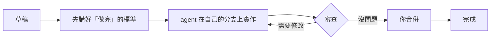
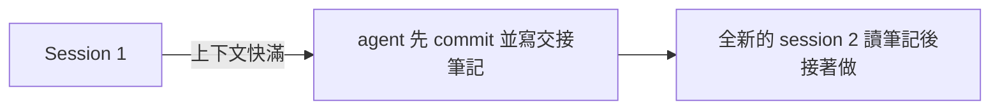

# Harnessboard


[English](README.md) · **繁體中文**

**Harnessboard 讓你把寫程式的工作交給 Claude Code，再像審 pull request 一樣驗收成果。**
你用一般的話寫下任務，AI agent 在專案的獨立副本裡完成它，你看 diff 再決定要不要合併。
多個任務可以同時進行，在你點頭之前，沒有任何一個會動到你的檔案。


> [!NOTE]
> **早期開發中（0.0.x）。** 執行器、`hb` 指令、網頁看板和 Loop 模式都可以使用；
> Windows 與 macOS 還沒有在實機上測試過。看板畫面截圖為英文介面，網頁設定中可切換成繁體中文。

**本頁目錄：** [名詞](#名詞) · [開始之前](#開始之前) · [安裝](#安裝) ·
[第一個任務](#第一個任務) · [任務怎麼流動](#任務怎麼流動) · [常用指令](#常用指令) ·
[進階閱讀](#進階閱讀)

## 為什麼用它

- **預設就安全**：每個任務在自己的 git 分支和資料夾裡工作，結果不好也不會有損失。
- **上下文保持精簡**：AI 的記憶（_上下文_）滿了之後表現會變差。Harnessboard 會要求
  agent 把進度寫成筆記，再用全新的 session 接著做。
- **會看額度**：隨時看你的 Claude 訂閱用量，快到上限就不再開新工作，重置後自動續跑。
- **不需要 API key**：直接使用你已經登入的 `claude`。
- **模型與推理深度自己選**：每個角色可以選模型和推理深度（例如實作用 Opus 加高深度，
  審查用較快的等級）。

## 名詞

| 名詞                  | 意思                                                                               |
| --------------------- | ---------------------------------------------------------------------------------- |
| **Agent**             | Harnessboard 替你執行的 AI 寫程式工具：Claude Code（也支援 Codex 和 Gemini CLI）。 |
| **任務（task）**      | 你描述的一件工作，例如「修好不穩定的日期測試」。                                   |
| **Worktree／分支**    | 給單一任務用的獨立資料夾和 git 分支，任務之間不會互相干擾。                        |
| **上下文（context）** | agent 一次能記住的量，看板上用進度條顯示。                                         |
| **交接（handoff）**   | 上下文滿了時 agent 寫下的筆記，讓下一個 session 能接著做。                         |
| **額度（quota）**     | Claude 方案的用量上限，每 5 小時重置。                                             |
| **需要你處理**        | 看板上等你回答、審核或允許指令的那一欄。                                           |

## 開始之前

| 你需要                   | 檢查指令           | 取得方式                                                                                      |
| ------------------------ | ------------------ | --------------------------------------------------------------------------------------------- |
| **Node.js 22.13 以上**   | `node -v`          | [nodejs.org](https://nodejs.org)（版本也寫在 `.nvmrc`）                                       |
| **Git**                  | `git --version`    | [git-scm.com](https://git-scm.com)（Windows 請裝 Git for Windows）                            |
| **已登入的 Claude Code** | `claude --version` | [Claude Code 文件](https://docs.claude.com/en/docs/claude-code)，裝好後執行一次 `claude` 登入 |

你需要 Claude Code 能使用的 Claude 訂閱，**不需要 API key**。支援 Linux、macOS 和 Windows。

Codex 使用 `codex app-server`（以 CLI 0.162.0 驗證）。需要沙盒外權限的請求會顯示在看板上；
Git 預設授權可讓提交留在任務的 worktree。詳見[代理程式與權限設定](docs/configuration.md#config-files-agents-and-permissions)。

任務摘要會以標準短上下文 API 單價估算 Codex 金額（美元），分開計算輸入、快取與輸出。
這是比較用的估算，訂閱不會按 token 計費。有明確模型與 token 數的舊紀錄會在讀取時補算；
只記為 `codex` 或沒有已確認單價的模型維持未記錄。計價基準與限制詳見
[用量估算](docs/configuration.md#usage-estimates)。

## 安裝

目前沒有發佈預先打包好的安裝檔，所以要從原始碼建置一次：

```bash
git clone https://github.com/AquilaWei/harnessboard.git
cd harnessboard
corepack enable          # 取得專案指定的 pnpm 版本
pnpm install
pnpm build               # 約一分鐘
```

接著幫指令取個短名字（想長期使用，就把這行放進 shell 的啟動檔）：

```bash
alias hb="node $PWD/packages/server/dist/cli.js"
hb --version             # 會印出版本，例如 0.1.1
```

<details>
<summary>Windows（PowerShell）與其他備註</summary>

- `corepack enable` 請用系統管理員身分的 PowerShell 執行一次，其他行不需要。
- 不用 `alias`，改用 `function hb { node C:\path\to\harnessboard\packages\server\dist\cli.js @args }`。
- 想要有圖示的視窗？也可以自己建置[桌面程式](docs/desktop-app.md)。

</details>

## 第一個任務

先拿一個用完就丟的練習專案，這樣不會動到重要的東西。

**1. 啟動伺服器**，放在它自己的終端機視窗裡：

```bash
hb serve
```

你會看到 `Harnessboard … is running at http://127.0.0.1:4317`。用瀏覽器開這個網址，就是看板。

**2. 在第二個終端機建一個練習專案。** Harnessboard 需要至少有一個 commit 的 git repository：

```bash
mkdir hello && cd hello
git init -b main
echo "# Hello" > README.md
git add . && git commit -m "init"
```

**3. 排入一個任務。** `--criteria` 說明「做完」的標準；不寫的話，agent 會先和你討論標準
（[為什麼](docs/workflow.md)）。

```bash
hb add "Add a short section about how to run this project to README.md" \
  --criteria "- README.md has a Usage section"
```

**4. 看它工作。** 任務會出現在看板上，終端機也能看：

```bash
hb ls                    # 每個任務一行：編號、狀態、已用上下文、標題
hb logs 1 -f             # 即時跟著 agent 的動作（Ctrl+C 結束跟隨）
```

**5. 完成後驗收。** 當 `hb ls` 顯示 `review`（看板上在「需要你處理」）：

```bash
hb diff 1                # agent 到底改了什麼
hb merge 1               # 滿意就合併進 main；不滿意用 hb chat 1 "請再…"
```

合併後任務的資料夾和分支會被移除，任務移到「完成」。

<details>
<summary>出問題了？</summary>

- **`claude: command not found`／agent 沒有啟動：** 執行 `claude --version`；失敗的話，先安裝並登入 Claude Code。
- **伺服器因為連接埠被占用而無法啟動：** 可能已經有另一個 `hb serve` 在跑。
  改用 `hb --port 4400 serve`，其他 `hb` 指令也要加上同樣的 `--port 4400`。
- **「not a git repository」或「no commits yet」：** 在專案資料夾重做第 2 步。
- **任務顯示 `Paused for quota`：** 已達到 Claude 用量上限，標題列顯示的重置時間過後會自動續跑。

</details>

## 任務怎麼流動



_看板上橘色的「需要你處理」卡片，就是只有你能往下推進的步驟：回答問題、核准標準、
允許有風險的指令，或驗收成果。_

agent 的上下文快滿時，Harnessboard 不會讓品質下滑，而是這樣接力：



## 常用指令

在任何資料夾都能執行 `hb`；任務屬於你執行 `hb add` 時所在的 repository。

| 指令                              | 作用                                    |
| --------------------------------- | --------------------------------------- |
| `hb add "<要做什麼>"`             | 排入一個任務                            |
| `hb ls` / `hb show <id>`          | 列出任務／顯示單一任務的 session 與費用 |
| `hb logs <id> [-f]`               | 印出或跟隨 agent 的 log                 |
| `hb diff <id>`                    | 看任務改了什麼                          |
| `hb chat <id> "<訊息>"`           | 和任務的 agent 對話                     |
| `hb merge <id>`                   | 把審過的任務合併進它的基底分支          |
| `hb stop <id>` / `hb resume <id>` | 停止任務／重新排入                      |
| `hb open <id>`                    | 在 Claude Code 裡接手這個任務的對話     |
| `hb delete <id>`                  | 刪除沒在執行的任務                      |

所有指令和參數見 [docs/cli.md](docs/cli.md)，`hb --help` 也能列出。

## 進階閱讀

| 主題                                     | 閱讀                                                                           |
| ---------------------------------------- | ------------------------------------------------------------------------------ |
| 驗收標準、設計師、測試員、審查者         | [docs/workflow.md](docs/workflow.md)                                           |
| 一個 session 做不完的大目標（Loop 模式） | [docs/loop-mode.md](docs/loop-mode.md)                                         |
| 網頁看板的所有功能                       | [docs/web-board.md](docs/web-board.md)                                         |
| 用手機（Tailscale）或 Android App 使用   | [docs/phone-access.md](docs/phone-access.md)                                   |
| 不想用終端機：桌面程式                   | [docs/desktop-app.md](docs/desktop-app.md)                                     |
| 設定、模型、推理深度、權限、Docker 沙箱  | [docs/configuration.md](docs/configuration.md)                                 |
| 建置、測試與參與開發                     | [docs/development.md](docs/development.md)、[CONTRIBUTING.md](CONTRIBUTING.md) |
| 內部架構                                 | [docs/architecture.md](docs/architecture.md)                                   |

詳細頁面目前只有英文。各版本的變更記錄見 [CHANGELOG.md](CHANGELOG.md)。

## 授權

[Apache-2.0](LICENSE)。Harnessboard 是獨立專案，與 Anthropic 沒有關係。網頁看板內含套件的授權見
[THIRD-PARTY-NOTICES.md](THIRD-PARTY-NOTICES.md)。
