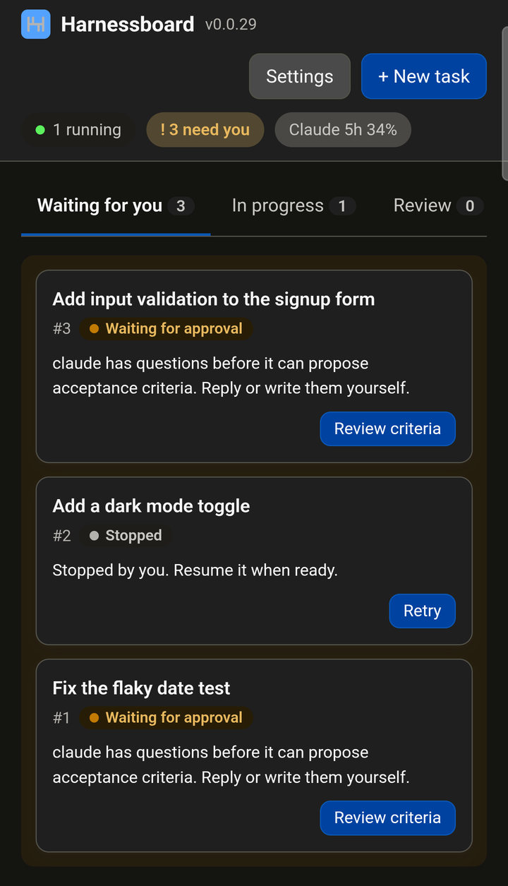

# Phone access

Follow progress, approve, answer and create tasks from your phone, from anywhere. The board
stays on your computer; the phone reaches it through [Tailscale](https://tailscale.com), so
nothing is opened to the internet.



1. **Install Tailscale** on the computer and the phone, signed in to the same tailnet. Turn
   on MagicDNS and HTTPS certificates in the Tailscale admin console.
2. **Add the remote host:** on the computer, open **Settings → Phone access**. It shows this
   computer's Tailscale name (`<machine>.<tailnet>.ts.net`); click **Add as remote host**
   and **Save**.
3. **Serve the board on the tailnet**, once, with the command the section shows (the port is
   the board's, 4317 by default):

   ```bash
   tailscale serve --bg 4317
   ```

   The first HTTPS request can take about 30 seconds while Tailscale issues the certificate.
   `tailscale serve reset` turns it off again.

4. **Pair the phone:** click **Pair a phone** and scan the QR code with the phone's camera.
   The code works once, for 5 minutes. Give the phone a name, tap **Pair**, then **Create passkey**:
   the phone asks for your fingerprint, face or screen lock. The phone is paired only once
   the passkey is made.
5. **Add to Home Screen** (optional on Android, needed for push on an iPhone): in Chrome's
   menu, **Add to Home Screen** (on Safari, in the Share menu). The Harnessboard icon then
   opens the board full screen, without the address bar.
6. **Turn on push notifications** (optional): on the phone, open **Settings** and switch on
   **Notify me when a task needs me**, then allow notifications. The phone gets a push when
   a task waits for permission, approval or review, or fails, even with the board closed.
   Tapping it opens the task on the tab that needs you (after unlocking, if the board was
   locked). A push carries only the task's number, title and status, never its changes or
   chat. Switching it off, or revoking the phone, stops the pushes.

**How the passkey protects the board**

- **Unlock:** the board locks each time it is opened on the phone (a reload or a server
  restart counts) and after 30 minutes without use. **Unlock** asks for the passkey.
- **Sensitive actions** ask again when the last check is more than 5 minutes old: creating,
  starting, approving, answering, merging or deleting tasks, and changing settings, agents,
  tool rules or paired devices. The action carries on once you confirm.
- **Lost phone:** revoke it under **Settings → Phone access → Paired devices**; it loses
  access on its next request. There are no backup codes: pair the new phone the same way.
- **Browsers inside apps** (LINE, for example) cannot use passkeys. The board says so; open
  the page in Chrome or Safari from the app's menu, and the pairing code goes along.
- **On the computer itself** nothing changes: no pairing and no passkey.

**Recommended Tailscale settings**

- **Two-factor login** on the account that owns the tailnet.
- **Device approval**, so a new device cannot join the tailnet without you.
- **An access rule (ACL)** that lets only your phone reach this computer, so other devices
  or shared nodes in the tailnet cannot even load the pairing page.

**Limits**

- **The computer must be on** and Harnessboard running (desktop app or `hb serve`). A
  sleeping computer cannot be reached.
- **Push notifications on an iPhone** need iOS 16.4 or later and the board opened from the
  Home Screen; in Safari itself the switch says push is not available.
- Tailscale Funnel (the public internet) is always refused. Another HTTPS reverse proxy
  works too: add its host name as a remote host.

## Android app

The Android app (Android 8.0 or later, with Chrome) opens the same phone board with its own
icon. It runs the board in Chrome's engine, so it needs the Tailscale setup above (steps 1–3)
like the browser does.

1. **Install it:** build the APK as described in [Development](development.md) (no prebuilt
   APK is published at the moment), copy it to the phone and open it. Android asks once to
   allow installs from Chrome (or your file manager).
2. **Connect:** open **Harnessboard** and tap **Scan pairing QR**, then scan the QR code from
   **Settings → Phone access → Pair a phone** on the computer. Without a QR code, type the
   board's address (`https://<machine>.<tailnet>.ts.net`) and tap **Connect**.
3. **Pair:** the board opens inside the app with the pairing screen. Name the phone, tap
   **Pair**, then **Create passkey**, as in step 4 above. The app keeps the address; later the icon opens
   the board directly.

**What changes compared with the browser**

- **No URL bar**, once the board's asset links are verified (see below); the board fills the
  screen.
- **Its own icon and its own entry in the task switcher**, separate from Chrome's tabs.

**What stays the same**

- **Passkey, lock and push rules:** the same passkey, the 30-minute lock, the check before
  sensitive actions and the same push notifications.
- **Chrome's storage:** the app uses Chrome's cookies and site data, so a phone already
  paired in Chrome stays paired; just type the address in step 2.
- **Revoking** the phone on the computer locks out the app and Chrome together.

**Push in the app:** when you turn on push, Android asks whether **Harnessboard** may send
notifications. The pushes then come from the app, and tapping one opens the task in the app,
even when the app was closed. This needs the board's asset links verified (no URL bar, see
below); otherwise Chrome shows the pushes and a tap opens a Chrome tab. On Android 8–11 the app
can appear in "Open with" lists for web links, because it takes the board's links; links to other
sites are passed on to your browser.

**Change board:** long-press the app icon and tap **Change board**. The app forgets the
address and shows the setup screen again; the computer still lists the phone until you
revoke it.

**URL bar still showing?** The board tells Android which apps it trusts through
`/.well-known/assetlinks.json`, using the app's signing fingerprints. For a released APK,
copy the fingerprint printed in the release's CI log; for an app you built yourself, its own
(see [Development](development.md)). Paste it under **Settings → Phone access → Android app →
App signing fingerprints**, **Save**, then clear Chrome's data for the app or reinstall it
so Android checks again.
